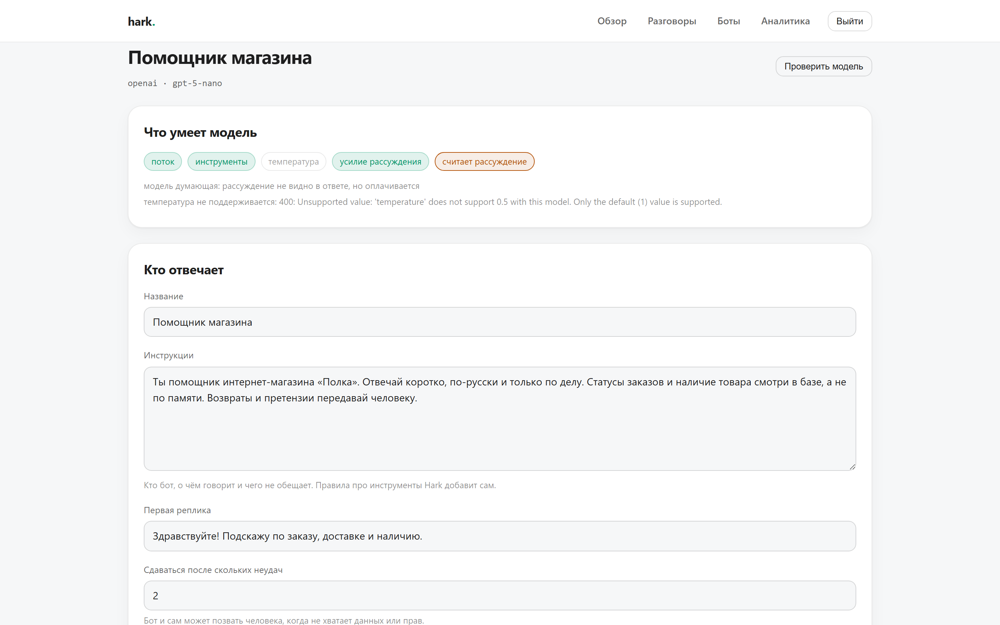

# Hark

Ein selbst gehosteter KI-Chatbot für die eigene Website, bei dem jede Antwort einen Beleg mitbringt.

[English](README.md) · [Русский](README.ru.md)


## Worum es geht

Baukästen für Chatbots gibt es reichlich, und fast alle sind Blackboxes. Der Bot sagt einem Kunden etwas Falsches, und niemand kann rekonstruieren, warum: welche Anweisung griff, was die API zurückgab, was das Modell überhaupt gelesen hat. Die Person, die das Gespräch übernimmt, erbt denselben Nebel.

Hark beantwortet diese Frage auf dem Bildschirm. Jede Antwort lässt sich aufklappen: die Anweisung, jeder Werkzeugaufruf mit Anfrage und Rückgabe, die aus der Datenbank gelesenen Zeilen, Token getrennt nach Eingabe, Ausgabe und Denken, und was das gekostet hat.

Kein SaaS, keine Tarife, keine Plätze. Eine Binärdatei, daneben eine Datei.

## Nicht an ein Modell gebunden

Der Bot läuft auf OpenAI, auf Anthropic und auf allem, was das OpenAI-Format spricht: Ollama, vLLM, LM Studio, OpenRouter, der eigene Server. Der Wechsel sind zwei Felder in den Einstellungen.

Die Anbieter sind sich uneinig darüber, was sie annehmen, und diese Uneinigkeit steht in keiner Dokumentation. `gpt-5-nano` lehnt `temperature` rundweg ab: „Nur der Standardwert wird unterstützt." Das alte Feld `max_tokens` ebenfalls. Ein Baukasten mit Temperatur-Schieberegler zerlegt bei diesem Modell jede Anfrage.

Also fragt Hark nach. Ein Knopf schickt einige winzige Anfragen und hält fest, was zurückkam:



Danach zeigen die Einstellungen nur noch die Regler, die dieses Modell wirklich annimmt. Nichts anderes wird angeboten, nichts Abgelehntes je gesendet.

## Das Denken ist der größere Teil der Rechnung

Denkende Modelle verbrauchen Token, die niemand zu sehen bekommt. Gemessen an einem echten Gespräch durch dieses Produkt:

| | Token |
|---|---|
| Eingabe | 777 |
| Ausgabe | 288 |
| davon Denken | **192** |

Zwei Drittel der bezahlten Ausgabe stehen nicht in der Antwort. Hark führt die Denk-Token in einer eigenen Spalte und zeigt ihren Anteil im Gespräch und in der Auswertung: Ein Kostenbericht, der sie in „Ausgabe" einrechnet, ist weniger falsch als unbrauchbar.


## Werkzeuge

**HTTP.** Beliebige Adresse. Methode, Vorlage mit `{Platzhaltern}`, Kopfzeilen, Rumpf. Die Argumente des Modells werden in Pfad und Abfrage eingesetzt.

**SQL.** Ein Zugang zur eigenen Datenbank, nur lesend. Die Abfrage schreibt das Modell, ob sie läuft entscheidet Hark:

1. nur `SELECT` und `WITH … SELECT`;
2. keine zweite Anweisung nach dem Semikolon;
3. kein `INSERT`, `DROP`, `ATTACH`, `PRAGMA`, `load_file`, `INTO OUTFILE` und dergleichen;
4. Tabellen gegen eine Positivliste geprüft, Unterabfragen eingeschlossen;
5. die Zeilengrenze durch Umschließen der Abfrage, nicht durch angehängtes `LIMIT` — das umgeht ein `UNION`;
6. eine Zeitgrenze für die Ausführung.

Das ist Tiefenstaffelung, kein Ersatz für Rechte. Verbinden Sie mit einem Benutzer ohne Schreibrecht; im Formular steht es genau so.

Eine abgelehnte Abfrage wird nicht verschwiegen: Sie landet im Beleg, und man sieht, dass der Bot eine Tabelle lesen wollte, die ihn nichts angeht.

## Übergabe an einen Menschen

Der Bot gibt per Werkzeugaufruf auf, nicht per Phrasenabgleich. Er sagt es ausdrücklich, der Grund wandert in die Warteschlange, das Gespräch wechselt in den Wartezustand. Die zuständige Person sieht Grund und vollständigen Beleg, bevor sie ein Wort schreibt.


## Das Widget

Ein Tag auf der Seite:

```html
<script src="https://hark.example.com/widget/hark.js" data-bot="shop" defer></script>
```

10 KB, ohne Abhängigkeiten, das Markup in einem Shadow Root — CSS läuft in keine Richtung aus. Die Antwort kommt als Strom über SSE, Antworten der Betreuung werden per Abfrage nachgeholt.

Jeder Teil des Widgets ist optional. Füllt man nichts aus, bleibt ein nackter Verlauf mit Eingabefeld; füllt man alles aus, bekommt man einen runden Starter, einen Begrüßungsschirm mit vorbereiteten Fragen und eine Fußnote mit Link zur Datenschutzseite.


Die erlaubten Domains werden je Bot festgelegt. Eine leere Liste heißt: jede Seite.

## Aussehen

Schrift, Abstände, Farben und Hintergrund stehen im Reiter „Aussehen“: eine Schriftauswahl samt „wie auf der Seite“, Schriftgrad und Zeilenabstand, drei Dichten, Fenstermaße, Rundungen, Schatten oder Haarlinie, die Palette und ein Verlaufshintergrund als Fläche, Verlauf, Punkte, Raster oder Bild. Fünf Vorlagen setzen alles auf einmal.


Drei Farben werden gesetzt, der Rest folgt: gedämpfter Text, Haarlinien und die Blase des Bots werden aus Fläche und Textfarbe berechnet, die Beschriftung auf einer Füllung nach Kontrast. Wer das Häkchen „auto“ entfernt, übernimmt die Farbe selbst.

Werte des Themas landen direkt im CSS des Widgets und werden deshalb an einer Stelle geprüft: eine Farbe muss ein sechsstelliger Code sein, eine Adresse `https`, Zahlen werden begrenzt, unbekannte Varianten fallen auf die Vorgabe zurück.

Im Rahmen rechts läuft das Widget selbst, kein Entwurf — dieselbe Datei und derselbe Endpunkt für die Einstellungen, die auch die Seite bekommt. Auseinanderlaufen kann da nichts.

## Anbindungen

Eigene API und Datenbank liegen im Reiter „Anbindungen“, der auch als Erstes aufgeht, wenn man einen Bot öffnet. Die Art wird vor dem Formular gewählt, mit zwei Schaltflächen, damit nie überflüssige Felder auf dem Schirm stehen.


Die Schaltfläche „Prüfen“ ruft die Anbindung wirklich auf und zeigt, was zurückkam. Ein Tippfehler in der Verbindungszeichenfolge fällt hier auf und nicht mitten im Gespräch mit einem Besucher.

## Installation

```bash
go build -o hark .
./hark -manager du@example.com -password geheim
./hark
```

Dann `http://localhost:8080` öffnen. Oberfläche, Vorlagen und Widget stecken in der Binärdatei, die Datenbank liegt als Datei daneben.

Zum Umsehen:

```bash
./hark -demo     # ein Laden, zwei Werkzeuge, vier Gespräche mit Belegen
```

Die Demo läuft ohne API-Schlüssel und kostet nichts: Die Belege sind aufgezeichnet, nicht erzeugt.

## Einstellungen

| Schalter | Variable | Vorgabe |
|---|---|---|
| `-addr` | `HARK_ADDR` | `:8080` |
| `-db` | `HARK_DB` | `hark.db` |

Die Modellschlüssel liegen je Bot in der Datenbank, nicht in der Umgebung: Verschiedene Bots dürfen verschiedene Anbieter nutzen.

## Aufbau

```
internal/llm      Anbieter und Fähigkeitsprüfung
internal/tools    HTTP- und SQL-Werkzeuge mit ihren Sperren
internal/chat     die Gesprächsschleife, die den Beleg schreibt
internal/store    SQLite-Schema und Abfragen
internal/web      Oberfläche, Widget-API, Vorlagen und das Widget selbst
```

## Tests

```bash
go test ./...
```

Schleife, Beleg und SQL-Sperren werden ohne Netz geprüft: Ein vorgetäuschter Anbieter spielt ein aufgezeichnetes Gespräch ab, während das HTTP-Werkzeug einen echten Server neben dem Test aufruft.

Tests gegen einen echten Anbieter werden übersprungen, solange man sie nicht anfordert:

```bash
HARK_LIVE_KEY=... HARK_LIVE_MODEL=gpt-5-nano go test ./internal/llm -run Live -v
```

## Lizenz

MIT.
