# Hark

A self-hosted AI chat bot for your site, where every answer carries a receipt.

[Русский](README.ru.md) · [Deutsch](README.de.md)

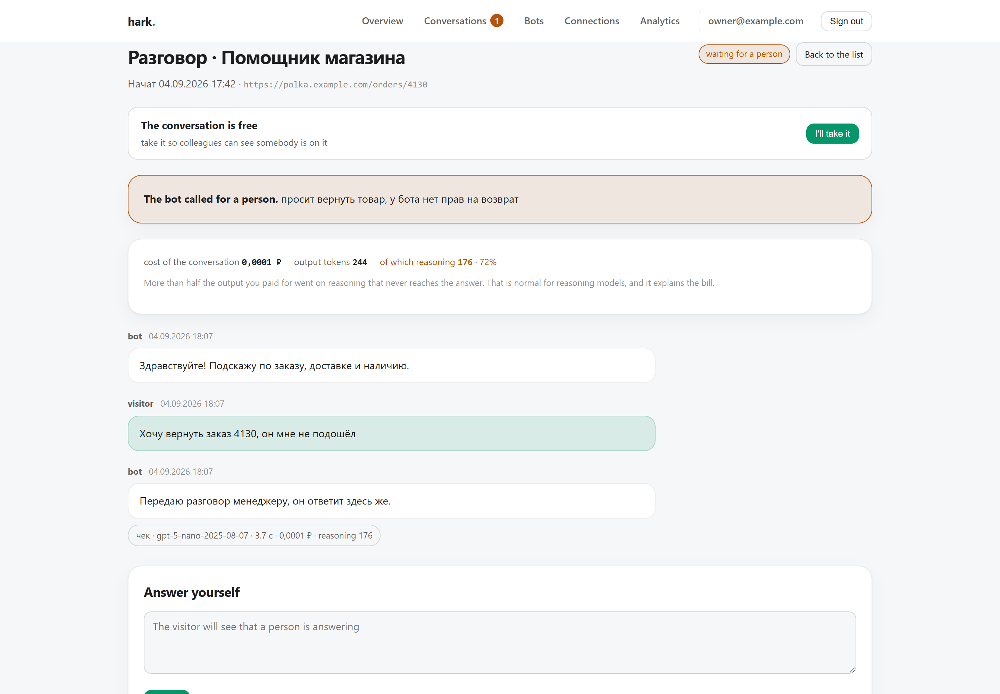

## What it is

Chat bot builders are everywhere and they are all black boxes. The bot tells a customer something wrong and nobody can reconstruct why: which instruction fired, what the API returned, what the model actually read. The manager who picks up the conversation inherits the same fog.

Hark answers that question on screen. Open any reply and the receipt unfolds: the instruction, every tool call with its request and response, the rows read from your database, tokens split into prompt, completion and reasoning, and what it cost.

No SaaS, no plans, no seats. One binary, one file next to it.

## Not tied to one model

The bot runs on OpenAI, on Anthropic, and on anything speaking the OpenAI chat format: Ollama, vLLM, LM Studio, OpenRouter, your own server. Switching is two fields in the settings.

Providers disagree about what they accept, and the disagreement is not in the docs. `gpt-5-nano` rejects `temperature` outright: *"Only the default (1) value is supported"*. It also rejects the older `max_tokens`. A builder that shows a temperature slider breaks every request against that model.

So Hark asks. One button sends a few tiny requests and records what came back:

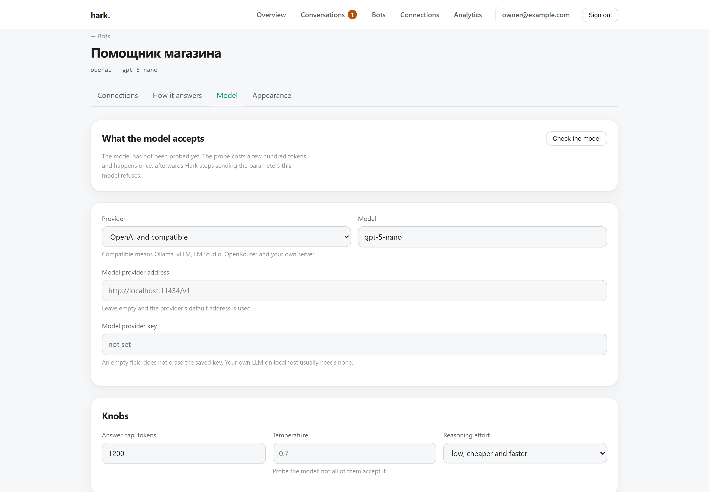

The settings then show only the knobs that model actually takes. Nothing else is offered, and nothing rejected is ever sent.

## Reasoning is most of your bill

Thinking models spend tokens you never see. Measured on a real conversation through this product:

| | tokens |
|---|---|
| prompt | 777 |
| completion | 288 |
| of which reasoning | **192** |

Two thirds of the paid output is not in the answer. Hark stores reasoning tokens in their own column and shows the share on the conversation and in analytics, because a cost report that folds them into "completion" is not wrong so much as useless.

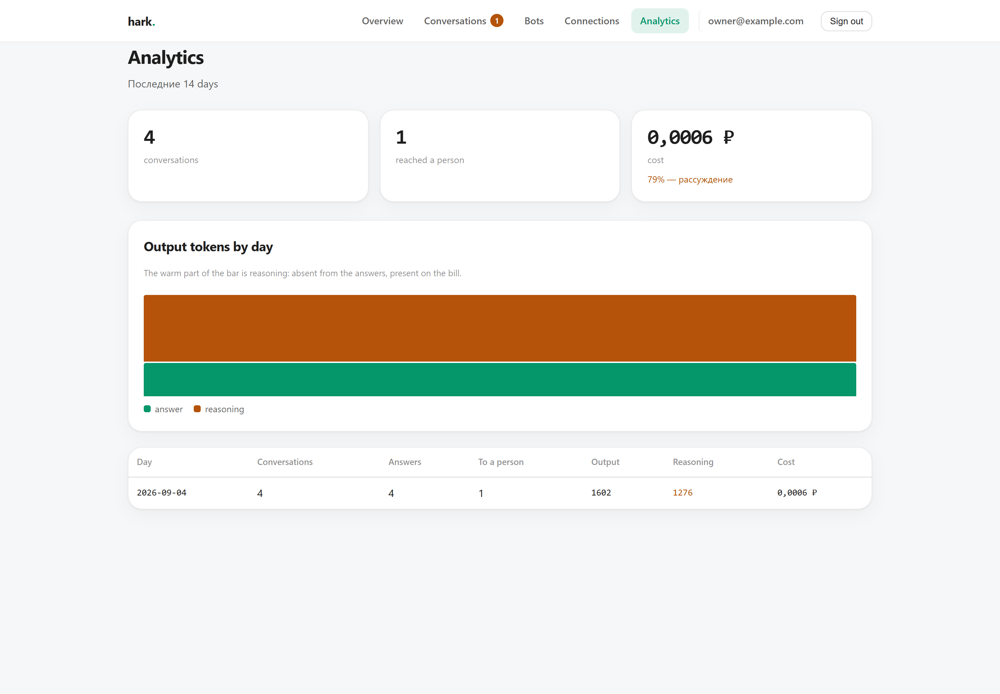

## Connections

Your own API and your database live on the Connections tab, which is also what opens first when you enter a bot. You pick the kind before the form, with two buttons, so no irrelevant fields are ever on screen.

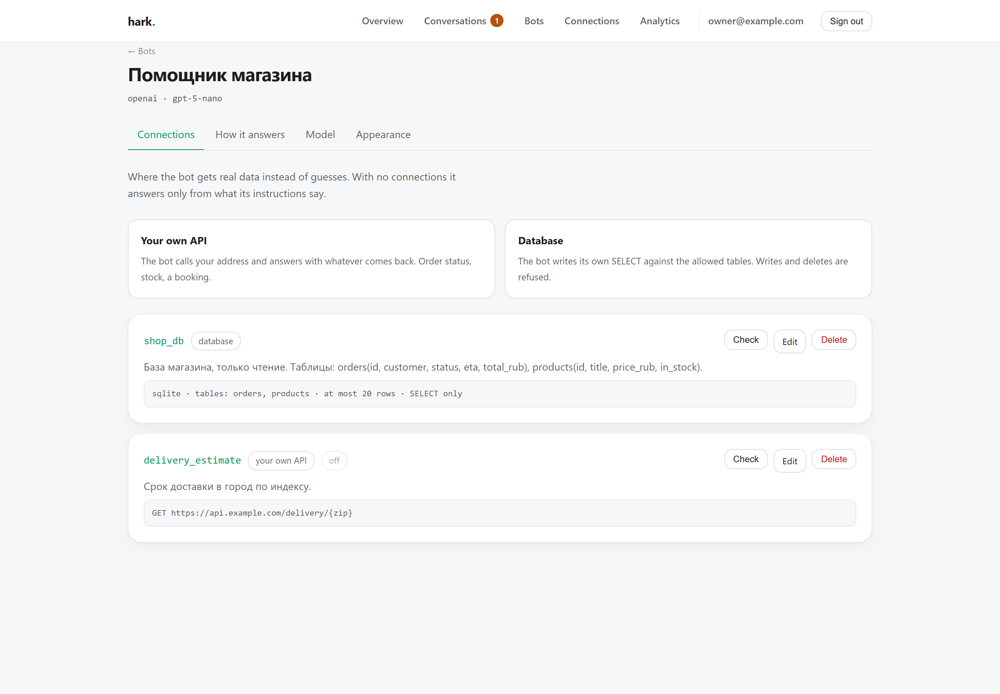

The Check button calls the connection for real and shows what came back. A typo in a connection string surfaces here rather than mid-conversation with a visitor.

**HTTP.** Any endpoint. Method, URL template with `{placeholders}`, headers, body. Arguments the model produces are substituted into the path and the query.

**SQL.** A read-only connection to your database. The model writes the query; Hark decides whether it runs:

1. `SELECT` and `WITH … SELECT` only
2. no second statement after a semicolon
3. no `INSERT`, `DROP`, `ATTACH`, `PRAGMA`, `load_file`, `INTO OUTFILE` and friends
4. tables checked against an allowlist, subqueries included
5. row cap applied by wrapping the query rather than appending `LIMIT`, because an appended one is escaped by `UNION`
6. statement timeout

That is defence in depth, not a substitute for permissions. Connect with a user that has no write grant. The field says so in the form.

A rejected query is not swallowed: it goes into the receipt, so you can see the bot tried to read a table it should not have.

## Handing over to a person

The bot gives up through a tool call, not through phrase matching. It says so explicitly, the reason travels to the queue, and the conversation moves to *waiting*. The manager sees the reason and the whole receipt before typing a word.

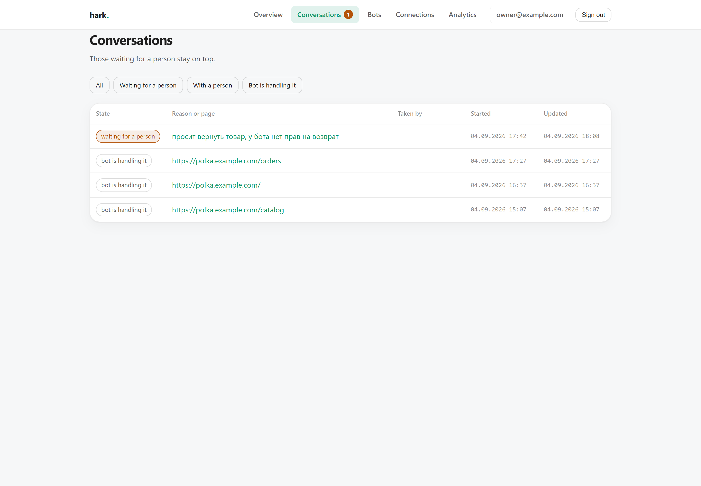

## When the bot gives up

The conversation joins a queue for a human, and you find out two ways at once.

An open admin tab gets the event over a stream: the count in the header grows, the tab title becomes "(3) Overview", a short sound plays. Nothing to configure; it works out of the box. The event carries the whole queue rather than "one more", so a dropped event, a sleeping laptop and a server restart all heal themselves.

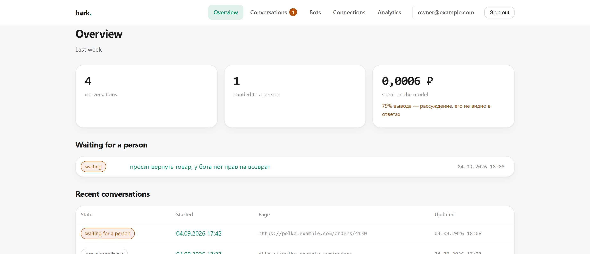

If nobody is keeping the admin open, Hark calls one address that you filled in yourself. There is no Telegram and no email inside Hark, and there won't be: Telegram is what you get by pasting `api.telegram.org/bot<token>/sendMessage`, and email is what you get by running your own bridge next to it. The button beside the field places a real call and shows you what came back.

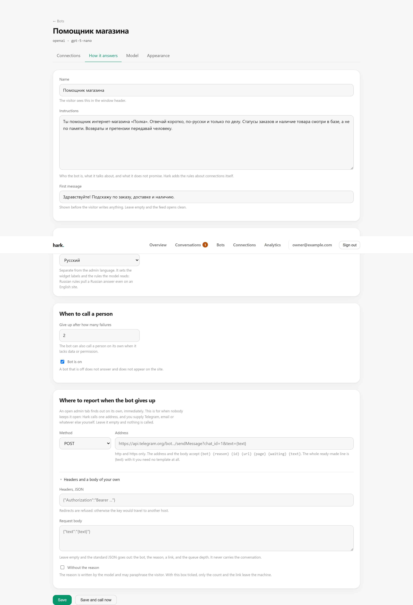

What leaves the machine is the fact, not the conversation: the bot, the reason, the queue depth and a link into the admin. The reason is written by the model and may paraphrase the visitor, so a "no reason" box leaves only the count and the link.

A waiting conversation has an owner. The "I'll take it" button marks it as yours, and colleagues see the name in the list itself — before they start typing, rather than after the visitor has received two answers from two people. Taking it is atomic: two simultaneous clicks produce exactly one winner, and the other person sees who got there first.

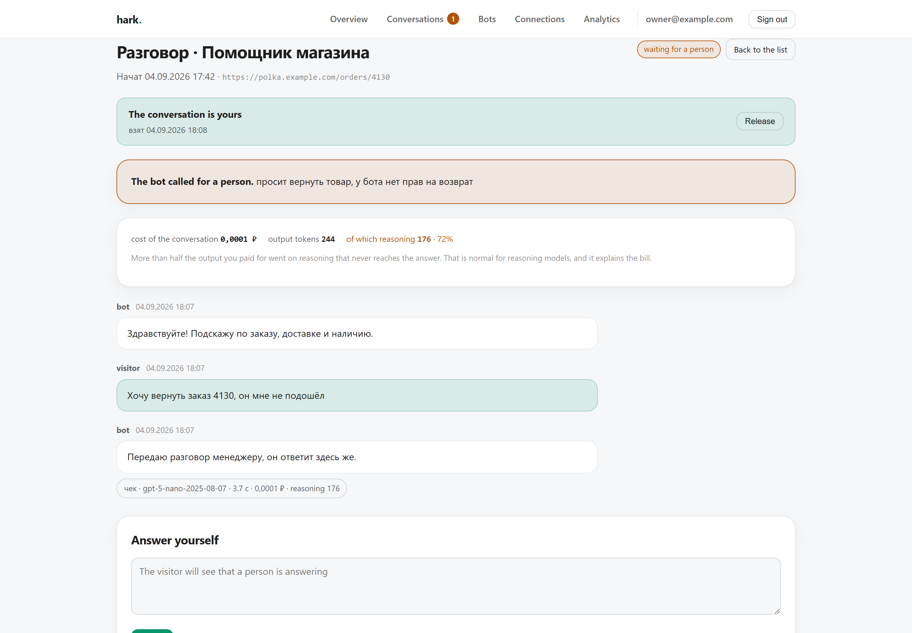

Anyone can release it, not just whoever took it: people go to lunch, and locking a visitor behind someone who left is the worst thing available. A manager's reply takes the conversation automatically if it was free; handing it back to the bot or closing it clears the mark.

Recording an escalation no longer depends on the visitor's request still being alive. A tab closed mid-sentence used to produce the worst outcome available: the visitor got "I'm handing you to a person" while the conversation stayed out of the queue, and the person nobody called never came.

## Managers

Who signs into the admin and answers when the bot gives up. There are no roles: everyone sees every conversation and can remove anyone else.

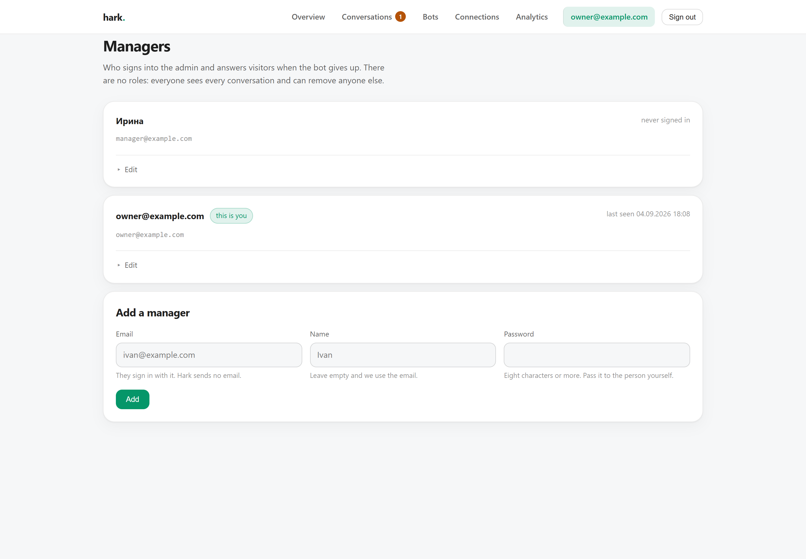

You cannot remove yourself, and you cannot remove the last manager: nobody could sign in afterwards, and recovery would need access to the machine. Changing a password kills that person's other sessions, because the reason you change one is often that someone else has it.

The first manager is created from the command line:

```bash
./hark -manager you@example.com -password secret
./hark -managers                                       # who already exists
./hark -manager you@example.com -password new -reset   # change a password
```

Without `-reset`, running it again with the same address refuses and tells you what to do instead. It used to change that person's password silently and lock them out.

## The widget

One tag on your page:

```html
<script src="https://hark.example.com/widget/hark.js" data-bot="shop" defer></script>
```

23 KB, and seven over the wire — Hark serves it gzipped. No dependencies, markup inside a shadow root so neither side's CSS leaks. Streams the answer over SSE and picks up manager replies by polling.

Every part of the widget is optional. Fill in nothing and you get a bare feed with an input; fill in everything and you get a round launcher, a welcome screen with ready-made questions, and a footnote linking to your privacy page.

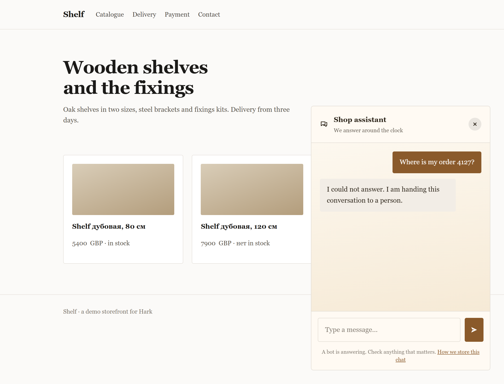

Origins are restricted per bot. An empty list means any site.

## Appearance

Font, spacing, colours and background live on the Appearance tab: a font list including "same as the site", type size and leading, three densities, panel dimensions, corner radii, shadow or hairline border, the palette, and a feed background as a solid colour, gradient, dots, grid or image. Five presets set everything at once.

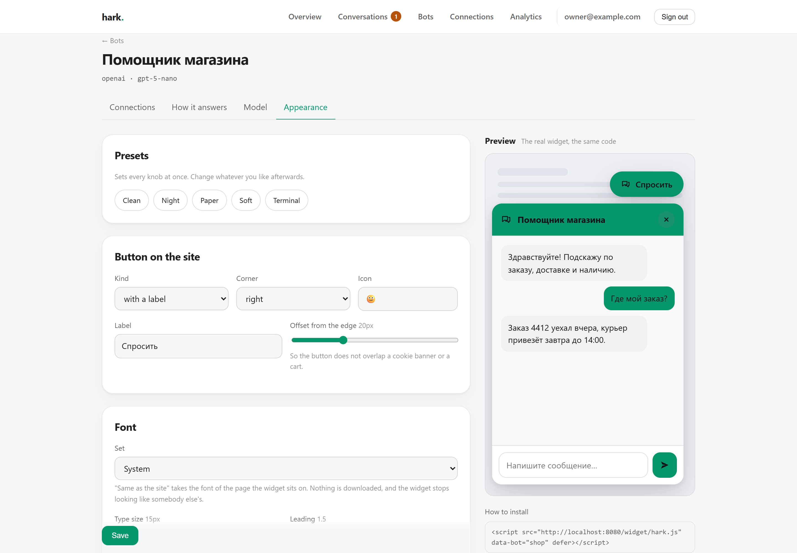


You set three colours and the rest follow: muted text, hairlines and the bot bubble are derived from the surface and the text colour, and the label on a filled button is picked by contrast. Clearing the "auto" box takes a colour back under manual control.

Theme values land directly in the widget's CSS, so they are cleaned in one place: a colour must be a six-digit code, a URL must be `https`, numbers are clamped, and unknown options fall back to the default.

The frame on the right runs the widget itself rather than a mock-up. It loads the same file and the same settings endpoint the site gets, so it has no way to drift from the live thing.

## Languages

The admin and the widget speak Russian and English. Each manager picks their own interface language: a team can hold both a Russian speaker and an English one, and a single shared setting would make one of them suffer.

The bot's language is set separately, on the "How it answers" tab. It drives the widget labels and the rules the model reads: Russian rules pull a Russian answer even on an English site, and no amount of instructions fixes that.

Adding a language means translating one file:

```bash
go run ./cmd/locale            # what exists and what is missing
go run ./cmd/locale fr > internal/lang/locales/fr.json
```

The translation key is the Russian source string itself, the way gettext does it. So a template shows what it will print without a trip to a dictionary, and an untranslated string stays Russian instead of turning into `nav.bots`. There is one cost: editing the Russian wording breaks the link to the translation. `go test ./internal/lang` catches it, comparing the dictionaries against the code and reporting both gaps and orphans.

## Install

```bash
go build -o hark .
./hark -manager you@example.com -password secret
./hark
```

Then open `http://localhost:8080`. The binary carries the admin UI, the templates and the widget inside it; the database is a file next to it.

To look around first:

```bash
./hark -demo     # a shop, two connections, four conversations with receipts
```

The demo seeds without an API key and spends nothing: the receipts are recorded, not generated.

Or in a container:

```bash
docker compose up -d
docker compose run --rm hark -manager you@example.com -password secret
```

A 42 MB image, running as a non-root user, with the database in a named volume. SQLite here is pure Go, so there is no cgo, the binary is static, and it cross-compiles to arm64 for a Raspberry Pi without any of the usual pain.


## Configuration

| Flag | Env | Default |
|---|---|---|
| `-addr` | `HARK_ADDR` | `:8080` |
| `-db` | `HARK_DB` | `hark.db` |

Model keys live in the database per bot, not in the environment: different bots can use different providers.

## Layout

```
internal/llm      providers, capability probe
internal/tools    HTTP and SQL tools with their guards
internal/chat     the conversation loop that writes the receipt
internal/store    SQLite schema and queries
internal/web      admin, widget API, templates, the widget itself
```

## Tests

```bash
go test ./...
```

The engine, the receipt and the SQL guards are covered without touching the network: a fake provider replays a scripted conversation while the HTTP tool calls a real server started next to the test.

Live tests against a real provider are skipped unless you ask for them:

```bash
HARK_LIVE_KEY=... HARK_LIVE_MODEL=gpt-5-nano go test ./internal/llm -run Live -v
```

## Licence

MIT.
