# Hark

Самостоятельный чат-бот для сайта, где у каждого ответа есть чек.

[English](README.md) · [Deutsch](README.de.md)

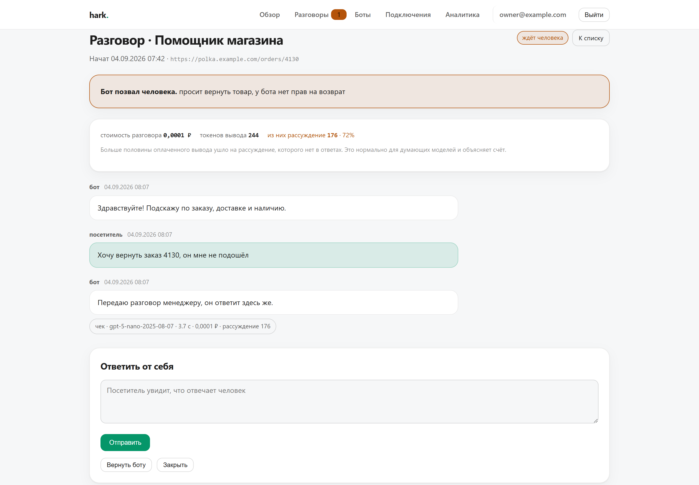

## Что это

Конструкторов ботов много, и почти все они чёрные ящики. Бот сказал клиенту глупость — и никто не может восстановить почему: какая инструкция сработала, что вернул API, что модель вообще прочитала. Менеджер, который принимает разговор, получает тот же туман.

Hark отвечает на этот вопрос прямо на экране. Раскрываете любой ответ и видите чек: инструкция, каждый вызов инструмента с запросом и ответом, строки, прочитанные из вашей базы, токены отдельно на ввод, вывод и рассуждение, и во что это обошлось.

Не SaaS: тарифов, мест и подписки нет. Один бинарник и файл базы рядом.

## Не привязан к одной модели

Бот работает на OpenAI, на Anthropic и на всём, что говорит в формате OpenAI: Ollama, vLLM, LM Studio, OpenRouter, свой сервер. Переключение — два поля в настройках.

Поставщики расходятся в том, что принимают, и расхождение это не написано в документации. `gpt-5-nano` отвергает `temperature` наотрез: «поддерживается только значение по умолчанию». Старое поле `max_tokens` тоже отвергает. Конструктор, который показывает ползунок температуры, ломает с этой моделью каждый запрос.

Поэтому Hark спрашивает. Одна кнопка отправляет несколько крошечных запросов и записывает, что вернулось:

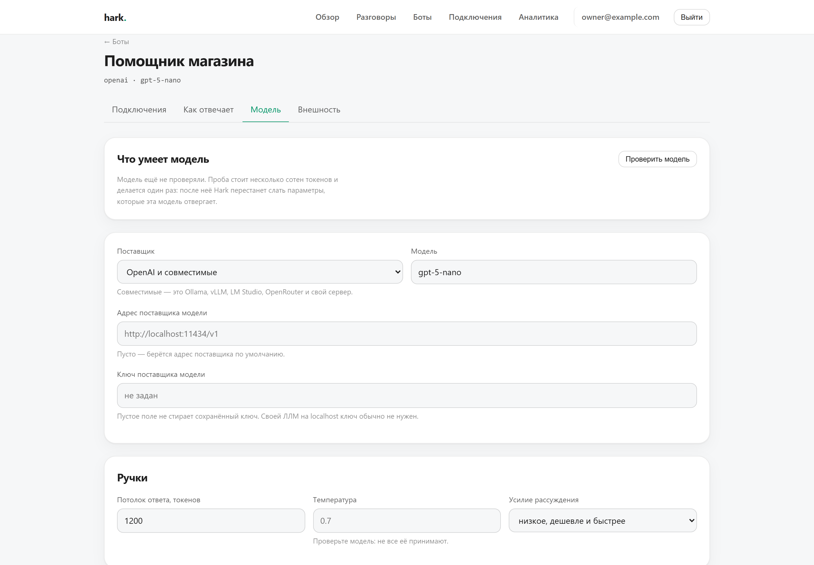

Дальше в настройках остаются только те ручки, которые эта модель принимает. Ничего лишнего не предлагается и ничего отвергнутого не отправляется.

## Рассуждение — большая часть счёта

Думающие модели тратят токены, которых вы не видите. Замер на настоящем разговоре через этот же продукт:

| | токенов |
|---|---|
| ввод | 777 |
| вывод | 288 |
| из них рассуждение | **192** |

Две трети оплаченного вывода не попали в ответ. Hark держит рассуждение отдельной колонкой и показывает его долю в разговоре и в аналитике: отчёт, где рассуждение слито с выводом, не столько врёт, сколько бесполезен.

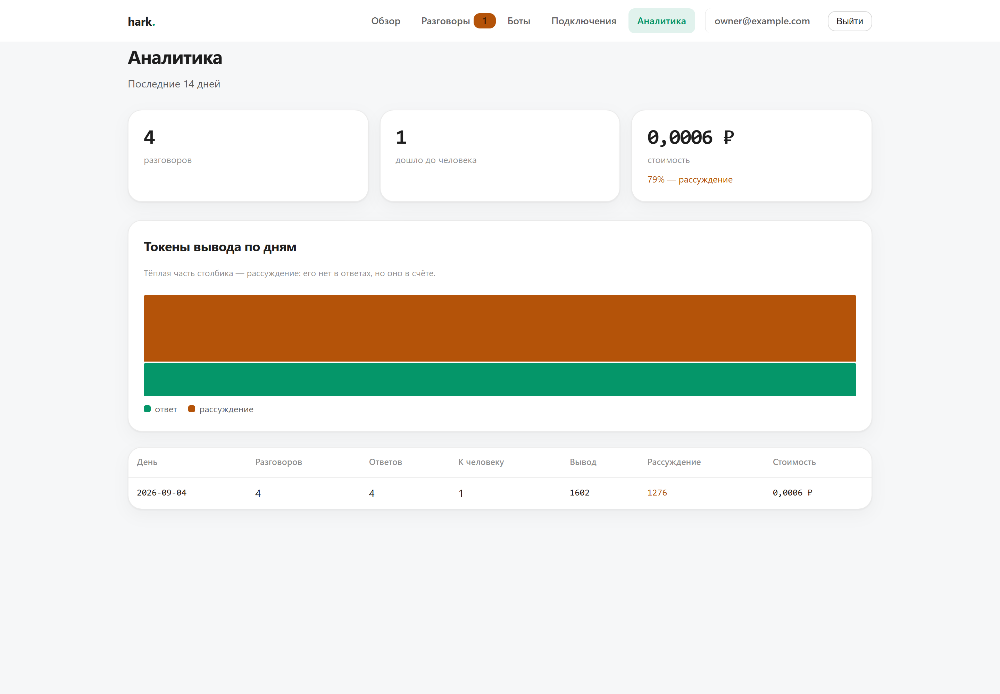

## Подключения

Свой API и база данных настраиваются на вкладке «Подключения» — она же открывается первой, когда заходишь в бота. Вид выбирается до формы, двумя кнопками, поэтому лишних полей на экране не бывает.

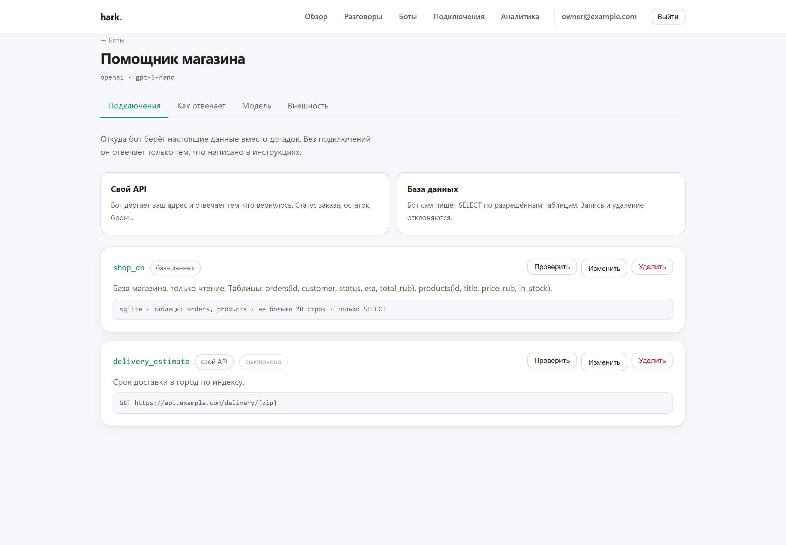

Кнопка «Проверить» дёргает подключение по-настоящему и показывает, что вернулось. Опечатка в строке подключения всплывает здесь, а не в разговоре с посетителем.

**HTTP.** Любой адрес. Метод, шаблон с `{подстановками}`, заголовки, тело. Аргументы от модели подставляются в путь и в строку запроса.

**SQL.** Подключение к вашей базе только на чтение. Запрос пишет модель, а пускать его или нет решает Hark:

1. только `SELECT` и `WITH … SELECT`;
2. никакого второго запроса после точки с запятой;
3. никаких `INSERT`, `DROP`, `ATTACH`, `PRAGMA`, `load_file`, `INTO OUTFILE` и подобного;
4. таблицы сверяются с белым списком, подзапросы тоже;
5. предел строк ставится обёрткой запроса, а не припиской `LIMIT`, — приписку обходит `UNION`;
6. таймаут на выполнение.

Это защита в глубину, а не замена правам доступа. Подключайте пользователем без права записи — так и написано в подсказке к полю.

Отклонённый запрос не заминается: он попадает в чек, и видно, что бот пытался прочитать таблицу, которую не должен был.

## Передача человеку

Бот сдаётся вызовом инструмента, а не совпадением фразы. Он говорит об этом прямо, причина уходит в очередь, разговор переходит в состояние ожидания. Менеджер видит причину и весь чек ещё до того, как напишет слово.

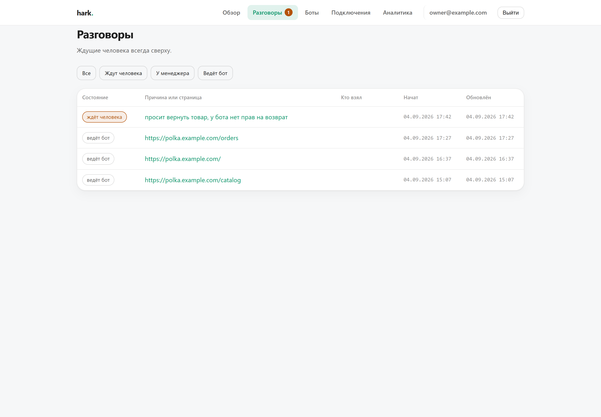

## Когда бот сдаётся

Разговор уходит в очередь к человеку, и об этом узнают сразу двумя путями.

Открытая вкладка админки получает событие потоком: цифра в шапке растёт, заголовок вкладки становится «(3) Обзор», раздаётся короткий звук. Настраивать для этого нечего, работает после установки. Событие несёт не «стало на одного больше», а всю очередь целиком, поэтому потерянное событие, уснувший ноутбук и перезапуск сервера чинятся сами.

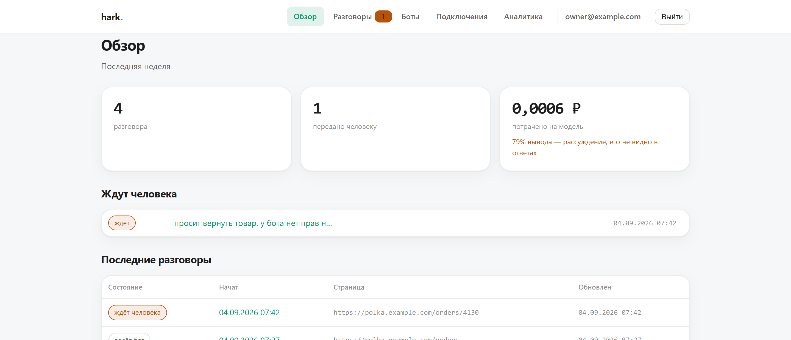

Если админку никто не держит открытой, Hark дёргает один адрес, который вы вписали сами. Телеграма и почты внутри нет и не будет: Телеграм получается тем, что вы вставляете `api.telegram.org/bot<токен>/sendMessage`, почта — тем, что рядом стоит ваш мост. Кнопка рядом с полем звонит по-настоящему и показывает, что ответили.

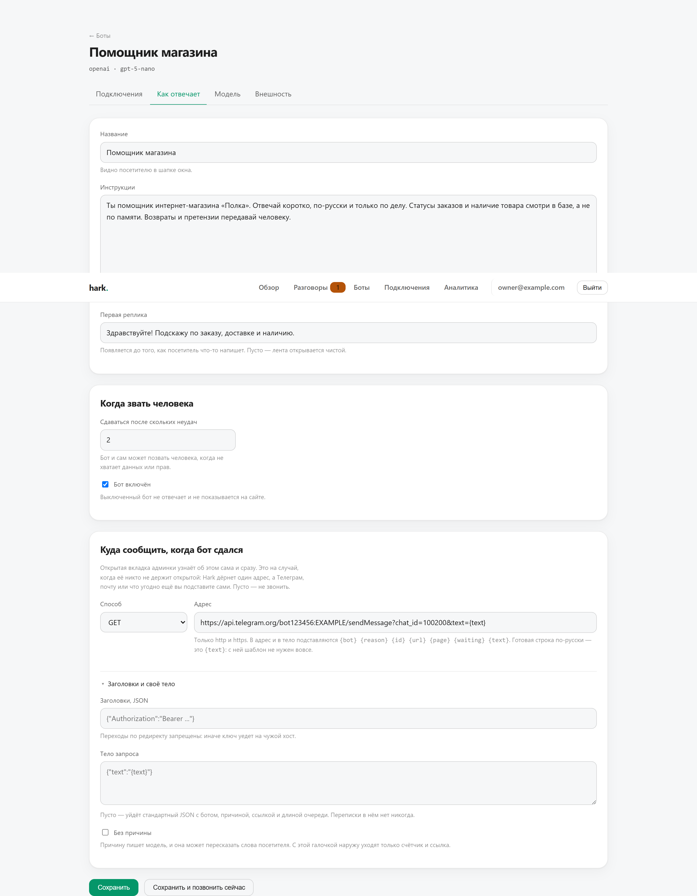

Наружу уходит факт, а не переписка: бот, причина, длина очереди и ссылка в админку. Причину пишет модель, и она может пересказать слова посетителя — галочка «без причины» оставляет только счётчик и ссылку.

У ждущего разговора есть тот, кто его взял. Кнопка «беру» отмечает разговор за вами, и коллеги видят имя прямо в списке — до того, как начнут печатать, а не после того, как посетитель получит два ответа от разных людей. Взятие атомарно: два одновременных нажатия выигрывает ровно одно, второй видит, кто успел.

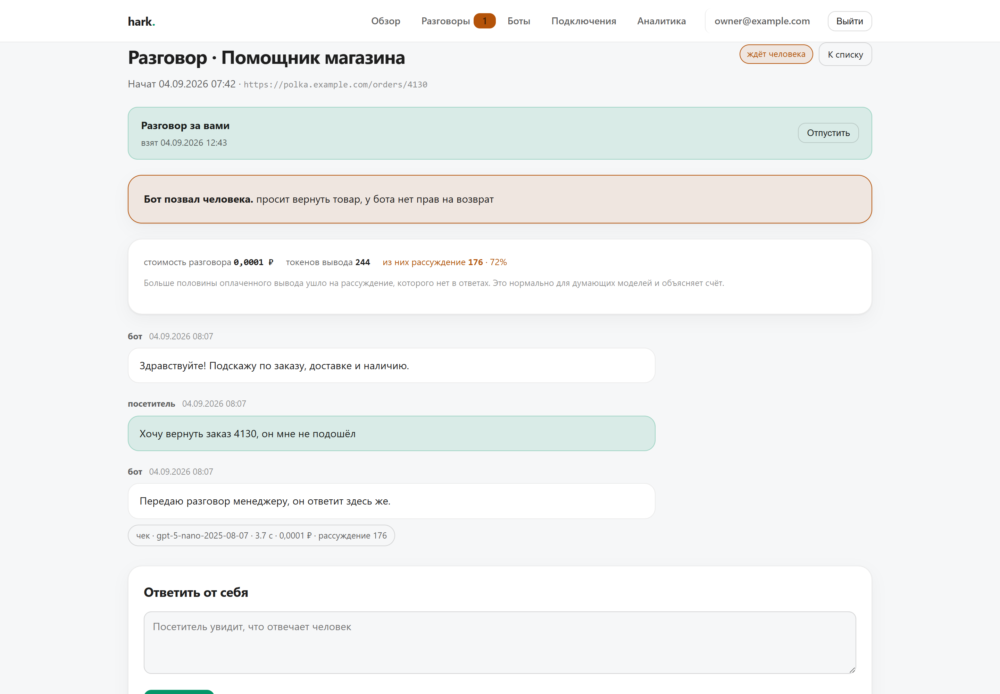

Отпустить может любой, не только взявший: человек мог уйти на обед, и запирать посетителя за ушедшим — худшее из возможного. Ответ менеджера забирает разговор себе сам, если он был свободен; возврат боту и закрытие отметку снимают.

Запись эскалации не зависит от того, жив ли ещё запрос посетителя. Закрытая на полуслове вкладка раньше давала худший исход: реплику «Передаю разговор менеджеру» посетитель получал, а разговор оставался вне очереди, и обещанного человека никто не звал.

## Менеджеры

Кто входит в админку и отвечает, когда бот сдался. Ролей нет: каждый видит все разговоры и может убрать любого другого.

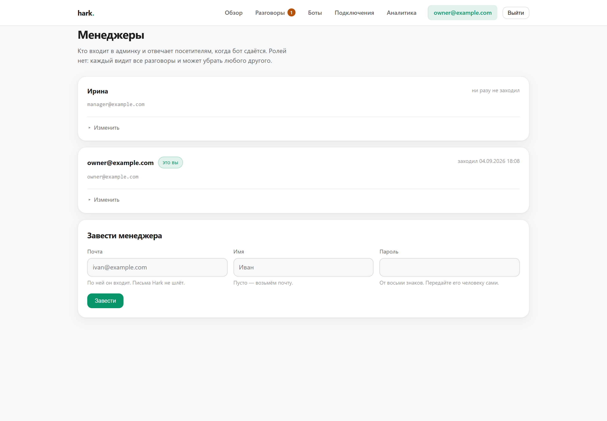

Себя убрать нельзя, последнего менеджера — тоже: иначе в админку не войдёт никто, а восстановиться можно только с самого сервера. Смена пароля гасит прочие входы этого человека, потому что её зовут в том числе тогда, когда доступ увели.

Первый менеджер заводится из командной строки:

```bash
./hark -manager you@example.com -password секрет
./hark -managers                                    # кто уже заведён
./hark -manager you@example.com -password новый -reset   # сменить пароль
```

Без `-reset` повторный запуск с той же почтой отказывает и объясняет, что делать. Раньше он молча менял человеку пароль и выбивал его из админки.

## Виджет

Один тег на странице:

```html
<script src="https://hark.example.com/widget/hark.js" data-bot="shop" defer></script>
```

23 КБ, а по проводу семь: Hark отдаёт его сжатым. Без зависимостей, разметка в теневом дереве — стили ни в одну сторону не протекают. Ответ идёт потоком через SSE, реплики менеджера подтягиваются опросом.

Каждая часть виджета необязательна. Ничего не заполнено — получается голая лента с полем ввода; заполнено всё — круглая кнопка, приветственный экран с готовыми вопросами и сноска со ссылкой на политику.

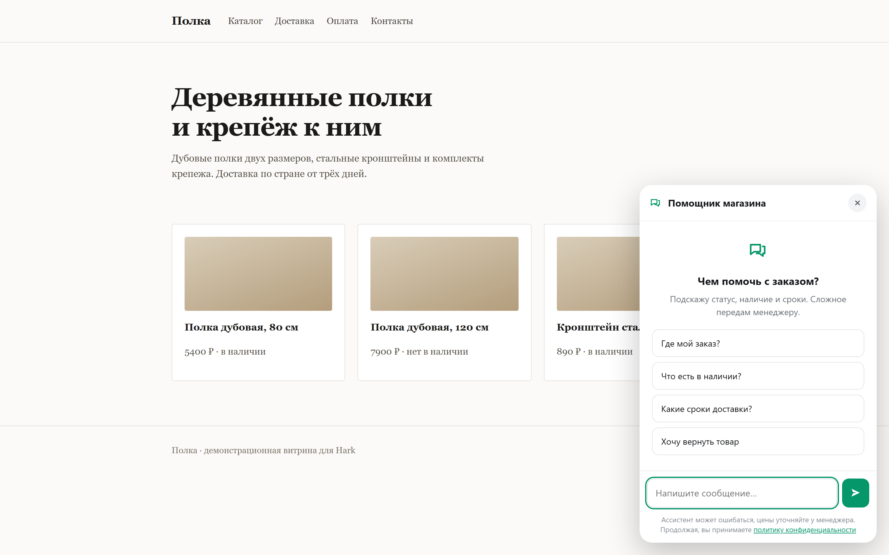

Домены ограничиваются у каждого бота. Пустой список означает «любой сайт».

## Внешность

Шрифт, отступы, цвета и фон настраиваются на вкладке «Внешность»: набор шрифтов включая «как на сайте», кегль и межстрочный, три плотности, размеры окна, скругления, тень или рамка, палитра, фон ленты сплошным цветом, градиентом, точками, сеткой или картинкой. Пять готовых наборов ставят всё разом.

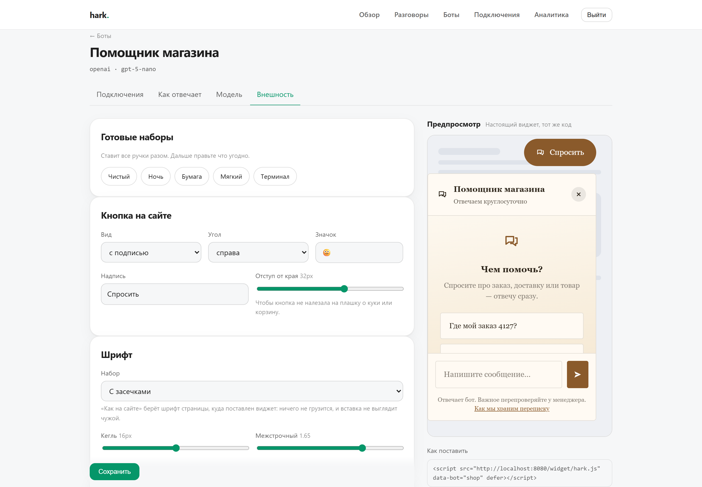

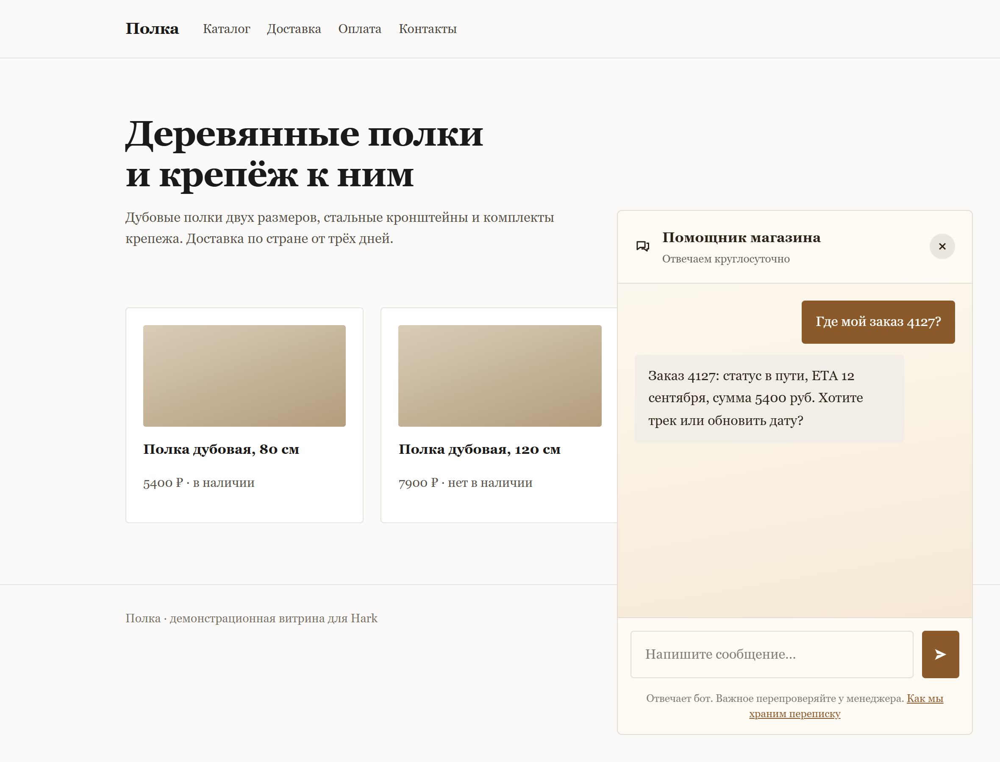

Три цвета задаются, остальные выводятся: приглушённый текст, линии и фон реплики считаются из полотна и текста, надпись на заливке — по контрасту. Снятая галочка «авто» забирает цвет себе.

Значения темы попадают прямо в текст CSS, поэтому чистятся в одном месте: цвет обязан быть шестизначным кодом, адрес — только `https`, числа загоняются в границы, неизвестные варианты откатываются к умолчанию.

В рамке справа крутится не макет, а сам виджет: тот же файл и тот же обработчик настроек, что и на сайте. Разойтись с живым виджетом ему нечем.

## Установка

```bash
go build -o hark .
./hark -manager you@example.com -password секрет
./hark
```

Дальше `http://localhost:8080`. Админка, шаблоны и виджет лежат внутри бинарника, база — файлом рядом.

Осмотреться перед настройкой:

```bash
./hark -demo     # магазин, два подключения, четыре разговора с чеками
```

Демонстрация ставится без ключа и ничего не тратит: чеки записаны, а не сгенерированы.

## Настройки

| Флаг | Переменная | По умолчанию |
|---|---|---|
| `-addr` | `HARK_ADDR` | `:8080` |
| `-db` | `HARK_DB` | `hark.db` |

Ключи моделей лежат в базе у каждого бота, а не в окружении: у разных ботов могут быть разные поставщики.

## Состав

```
internal/llm      поставщики и проба возможностей
internal/tools    инструменты HTTP и SQL со своими ограничителями
internal/chat     цикл разговора, который пишет чек
internal/store    схема SQLite и запросы
internal/web      админка, API виджета, шаблоны и сам виджет
```

## Тесты

```bash
go test ./...
```

Движок, чек и ограничители SQL проверяются без сети: поддельный поставщик отыгрывает записанный сценарий, а HTTP-инструмент ходит в настоящий сервер, поднятый рядом с тестом.

Живые тесты против настоящего поставщика пропускаются, пока их не попросишь:

```bash
HARK_LIVE_KEY=... HARK_LIVE_MODEL=gpt-5-nano go test ./internal/llm -run Live -v
```

## Лицензия

MIT.
